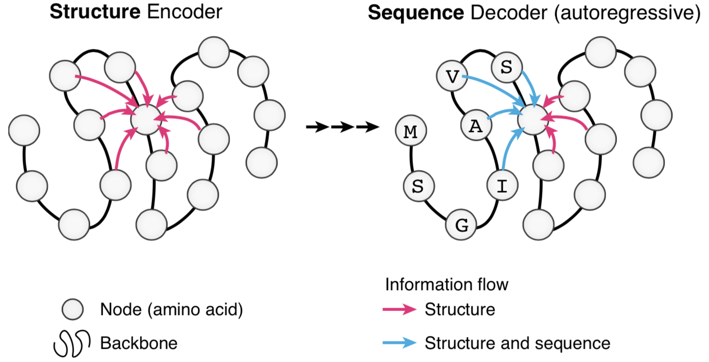

# Graph-Based Protein Design

This repo contains code for [Generative Models for Graph-Based Protein Design](https://papers.nips.cc/paper/9711-generative-models-for-graph-based-protein-design) by John Ingraham, Vikas Garg, Regina Barzilay and Tommi Jaakkola, NeurIPS 2019.

Our approach 'designs' protein sequences for target 3D structures via a graph-conditioned, autoregressive language model:
<p align="center"></p>


## Overview
* `struct2seq/` contains model code
* `experiments/` contains scripts for training and evaluating the model
* `data/` contains scripts for building and processing datasets in the paper

## Requirements
* Python >= 3.0
* PyTorch >= 1.0
* Numpy

## Citation
```
@inproceedings{ingraham2019generative,
author = {Ingraham, John and Garg, Vikas K and Barzilay, Regina and Jaakkola, Tommi},
title = {Generative Models for Graph-Based Protein Design},
booktitle = {Advances in Neural Information Processing Systems}
year = {2019}
}
```
